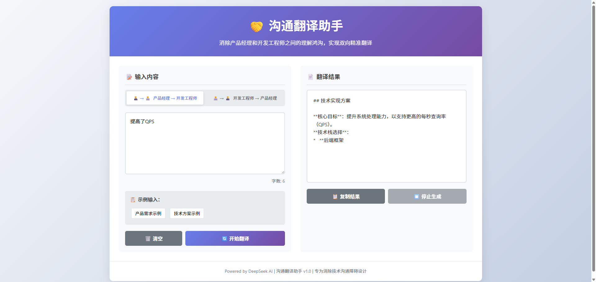

# AICross-domainCommunication
基于DeepSeek大模型的沟通翻译工具，帮助产品经理和开发工程师互相理解。

## 快速开始
1. 克隆项目
2. 安装依赖：`pip install -r requirements.txt`
3. 复制环境变量：`cp .env.example .env`
4. 设置DeepSeek API密钥到`.env`文件
5. 运行：`uvicorn app.main:app --reload --port 8000`

## 项目结构
AICROSS-DOMAINCOMMUNICATION/
├── app/                    app目录
│   ├── ai_engine.py        核心AI引擎
│   ├── __init__.py         包初始化文件
│   ├── main.py             FastAPI主应用
│   └── prompts.py          提示词模板
├── static/                 前端静态文件
│   ├── index.html          前端页面
│   └── style.css           样式文件
├── .env.example            环境变量示例
├── requirements.txt        Python依赖包列表
└── README.md               项目说明文档

## 效果图
